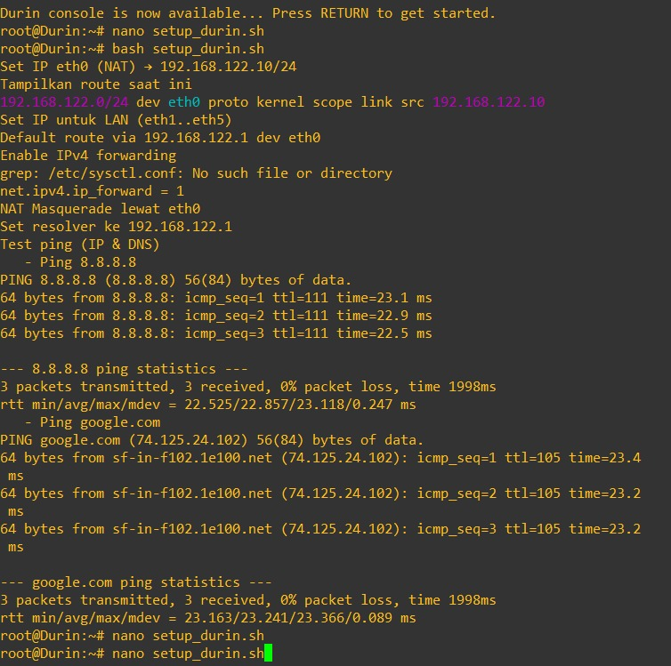
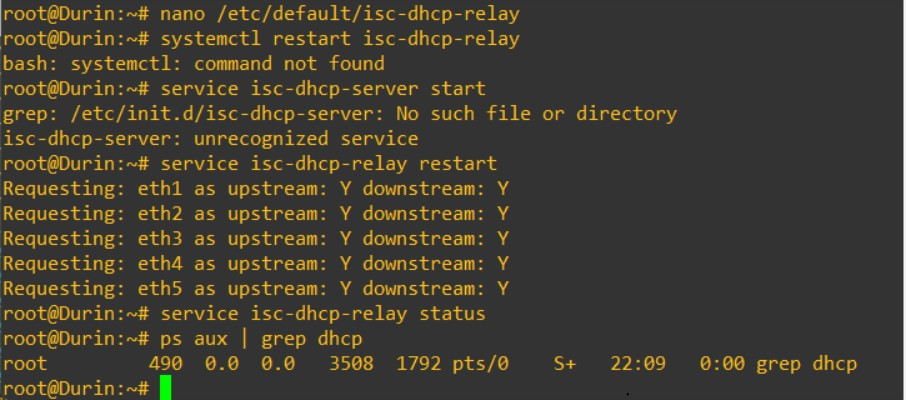
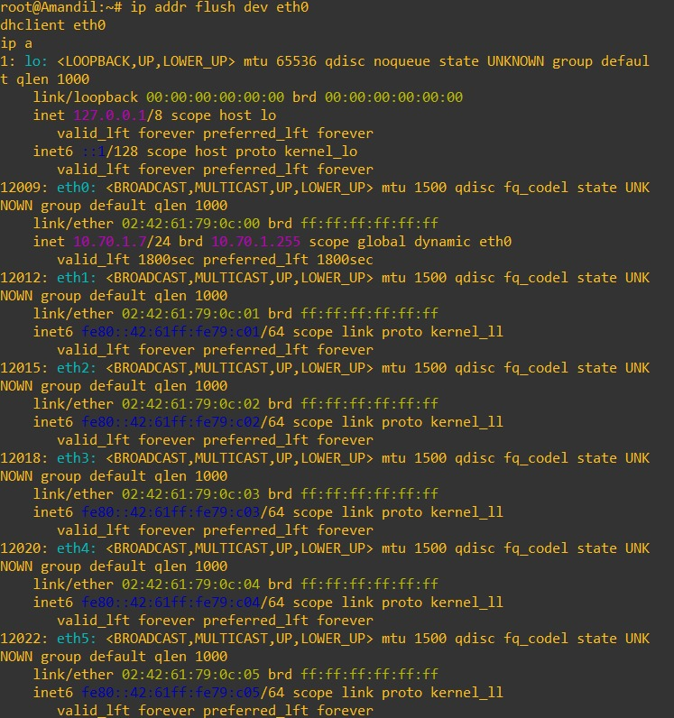
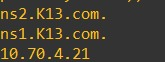
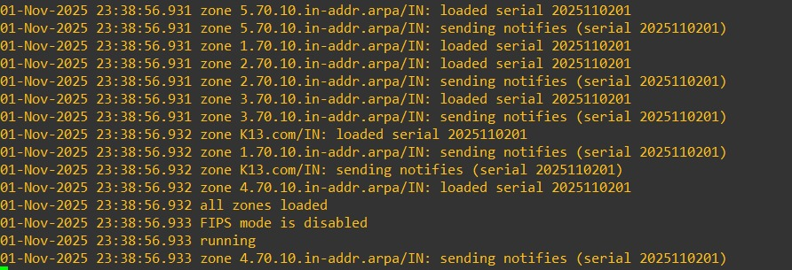
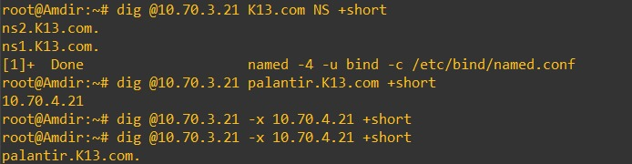
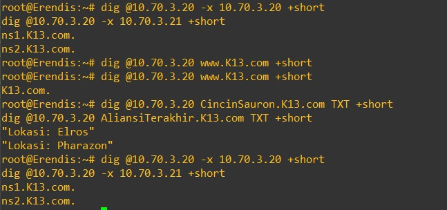
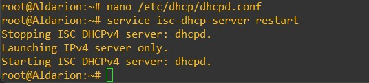

# Jarkom-Modul-3-2025-K-13


| Nama                   | NRP        |
|-------------------------|------------|
| Ahmad Rabbani Fata     | 5027241046 |
| Maritza Adelia Sucipto | 5027241111 |

Soal 1 - 10

### Soal 1

1.	Di awal Zaman Kedua, setelah kehancuran Beleriand, para Valar menugaskan untuk membangun kembali jaringan komunikasi antar kerajaan. Para Valar menyalakan Minastir, Aldarion, Erendis, Amdir, Palantir, Narvi, Elros, Pharazon, Elendil, Isildur, Anarion, Galadriel, Celeborn, Oropher, Miriel, Amandil, Gilgalad, Celebrimbor, Khamul, dan pastikan setiap node (selain Durin sang penghubung antar dunia) dapat sementara berkomunikasi dengan Valinor/Internet (nameserver 192.168.122.1) untuk menerima instruksi awal.


### Setup Durin:
Mengaktifkan Durin sebagai router NAT

```bash
#!/bin/bash
set -e                                           # hentikan jika ada error

echo "Set IP eth0 (NAT) → 192.168.122.10/24"     # info: set IP antarmuka NAT
ip link set eth0 up || true                      # up antarmuka eth0
ip addr show dev eth0 | grep -q "192.168.122.10/24" || ip addr add 192.168.122.10/24 dev eth0  # pasang IP NAT

echo "Tampilkan route saat ini"                  # info: cek route aktif
ip route || true                                 # print tabel routing

echo "Set IP untuk LAN (eth1..eth5)"             # info: up semua port LAN
ip link set eth1 up || true                      # up eth1
ip link set eth2 up || true                      # up eth2
ip link set eth3 up || true                      # up eth3
ip link set eth4 up || true                      # up eth4
ip link set eth5 up || true                      # up eth5

ip addr show dev eth1 | grep -q "10.70.1.1/24" || ip addr add 10.70.1.1/24 dev eth1  # IP gateway subnet1
ip addr show dev eth2 | grep -q "10.70.2.1/24" || ip addr add 10.70.2.1/24 dev eth2  # IP gateway subnet2
ip addr show dev eth3 | grep -q "10.70.3.1/24" || ip addr add 10.70.3.1/24 dev eth3  # IP gateway subnet3
ip addr show dev eth4 | grep -q "10.70.4.1/24" || ip addr add 10.70.4.1/24 dev eth4  # IP gateway subnet4
ip addr show dev eth5 | grep -q "10.70.5.1/24" || ip addr add 10.70.5.1/24 dev eth5  # IP gateway subnet5

echo "Default route via 192.168.122.1 dev eth0"  # info: set default gateway ke NAT host
ip route del default 2>/dev/null || true         # hapus default lama jika ada
ip route add default via 192.168.122.1 dev eth0  # tambah default route

echo "Enable IPv4 forwarding"                    # info: aktifkan IP forward
echo 1 > /proc/sys/net/ipv4/ip_forward          # aktif sementara (runtime)
grep -q '^net.ipv4.ip_forward=1' /etc/sysctl.conf || echo "net.ipv4.ip_forward=1" >> /etc/sysctl.conf  # persist
sysctl -p || true                                # reload sysctl

echo "NAT Masquerade lewat eth0"                 # info: aturan NAT keluar via eth0
if iptables -t nat -C POSTROUTING -o eth0 -j MASQUERADE 2>/dev/null; then  # cek jika rule sudah ada
  echo "   - Rule NAT sudah ada"                 # info: skip tambah ulang
else
  iptables -t nat -A POSTROUTING -o eth0 -j MASQUERADE  # tambahkan rule NAT
fi

echo "Set resolver ke 192.168.122.1"             # info: pakai DNS Valinor/host
echo "nameserver 192.168.122.1" > /etc/resolv.conf  # set DNS sementara

echo "Test ping (IP & DNS)"                       # info: uji konektivitas
echo "   - Ping 8.8.8.8"                          # uji jalur IP (tanpa DNS)
ping -c 3 8.8.8.8 || echo "Ping 8.8.8.8 gagal (cek NAT/route)"        # fallback pesan jika gagal
echo "   - Ping google.com"                       # uji DNS + konektivitas
ping -c 3 google.com || echo "Ping google.com gagal (cek DNS/resolver)" # fallback pesan jika gagal
```
### Setup Client (sesuaikan add dengan prefix ip tiap subnet)
Miriel:


```bash
ip link set eth0 up                               # up interface
ip addr flush dev eth0                            # bersihkan IP lama
ip addr add 10.70.1.23/24 dev eth0               # set IP klien
ip route replace default via 10.70.1.1           # set gateway (Durin eth1)
echo "nameserver 192.168.122.1" > /etc/resolv.conf  # set DNS sementara
ping -c 2 8.8.8.8; ping -c 2 google.com          # tes IP & DNS
```

Gilgalad:


```bash
ip link set eth0 up
ip addr flush dev eth0
ip addr add 10.70.2.20/24 dev eth0
ip route replace default via 10.70.2.1 # gateway subnet2
echo "nameserver 192.168.122.1" > /etc/resolv.conf
ping -c 2 8.8.8.8; ping -c 2 google.com
```
Erendis:
```bash
ip link set eth0 up
ip addr flush dev eth0
ip addr add 10.70.3.20/24 dev eth0
ip route replace default via 10.70.3.1  # gateway subnet3
echo "nameserver 192.168.122.1" > /etc/resolv.conf
ping -c 2 8.8.8.8; ping -c 2 google.com
```
Amdir:
```bash
ip link set eth0 up
ip addr flush dev eth0
ip addr add 10.70.3.21/24 dev eth0
ip route replace default via 10.70.3.1  # gateway subnet3
echo "nameserver 192.168.122.1" > /etc/resolv.conf
ping -c 2 8.8.8.8; ping -c 2 google.com
```
Aldarion:


```bash
ip link set eth0 up
ip addr flush dev eth0
ip addr add 10.70.4.20/24 dev eth0     
ip route replace default via 10.70.4.1   # Gateway = Durin eth4
echo "nameserver 192.168.122.1" > /etc/resolv.conf
```
Celebrimbor:
```bash
ip link set eth0 up
ip addr flush dev eth0
ip addr add 10.70.2.21/24 dev eth0
ip route replace default via 10.70.2.1 # gateway subnet2
echo "nameserver 192.168.122.1" > /etc/resolv.conf
ping -c 2 8.8.8.8; ping -c 2 google.com
```

cek ip
```bash
ip -br a
```

### Soal 2
2.	Raja Pelaut Aldarion, penguasa wilayah Númenor, memutuskan cara pembagian tanah client secara dinamis. Ia menetapkan:
○	Client Dinamis Keluarga Manusia: Mendapatkan tanah di rentang [prefix ip].1.6 - [prefix ip].1.34 dan [prefix ip].1.68 - [prefix ip].1.94.
○	Client Dinamis Keluarga Peri: Mendapatkan tanah di rentang [prefix ip].2.35 - [prefix ip].2.67 dan [prefix ip].2.96 - [prefix ip].2.121.
○	Khamul yang misterius: Diberikan tanah tetap di [prefix ip].3.95, agar keberadaannya selalu diketahui. Pastikan Durin dapat menyampaikan dekrit ini ke semua wilayah yang terhubung dengannya.

Khamul:


```bash
ip link set eth0 up
ip addr flush dev eth0
ip addr add 10.70.3.95/24 dev eth0
ip route replace default via 10.70.3.1
echo "nameserver 192.168.122.1" > /etc/resolv.conf
ping -c 2 8.8.8.8; ping -c 2 google.com

apt update
apt install isc-dhcp-client -y

ip -br a

ip link set eth0 up
ip addr flush dev eth0

ping -c3 10.70.3.1
```

Aldarion:


```bash
apt update
apt install isc-dhcp-server -y
nano /etc/dhcp/dhcpd.conf # edit konfigurasi DHCP
```
isi:
```bash
default-lease-time 1800;   # 30 menit (manusia)
max-lease-time 3600;       # 1 jam (maks)
authoritative;

# ========= HUMAN DYNAMIC =========
subnet 10.70.1.0 netmask 255.255.255.0 {
    range 10.70.1.6 10.70.1.34;
    range 10.70.1.68 10.70.1.94;
    option routers 10.70.1.1;
    option broadcast-address 10.70.1.255;
    option domain-name-servers 10.70.3.11;   # nanti ke Erendis (DNS master)
}

# ========= ELF DYNAMIC =========
subnet 10.70.2.0 netmask 255.255.255.0 {
    default-lease-time 600; # 10 menit (elf)
    range 10.70.2.35 10.70.2.67;
    range 10.70.2.96 10.70.2.121;
    option routers 10.70.2.1;
    option broadcast-address 10.70.2.255;
    option domain-name-servers 10.70.3.11;
}

# ========= KHAMUL FIXED ADDRESS =========
host khamul {
    hardware ethernet 02:42:4e:5e:98:00;  # MAC Khamul
    fixed-address 10.70.3.95;
}

# ========= OTHER SUBNETS (no DHCP here) =========
subnet 10.70.3.0 netmask 255.255.255.0 { } # DNS, DB LAN
subnet 10.70.4.0 netmask 255.255.255.0 { } # DHCP server LAN (Aldarion)
subnet 10.70.5.0 netmask 255.255.255.0 { } # PHP segmen, no DHCP
```

Durin:


```bash
apt update
apt install isc-dhcp-relay -y
nano /etc/default/isc-dhcp-relay # set tujuan & interface
```
isi:
```bash
SERVERS="10.70.4.20"   # IP Aldarion
INTERFACES="eth1 eth2 eth3 eth4 eth5"
```
```bash
service isc-dhcp-relay restart
service isc-dhcp-relay status
ps aux | grep dhcp
```
Gilgalad:


```bash
apt update
apt install isc-dhcp-client -y
dhclient -r eth0
dhclient eth0
ip a
```

```bash
ip addr flush dev eth0
dhclient eth0
ip a
```

Miriel:


Amandil:



Celebrimbor:


```bash
apt update
apt install isc-dhcp-client -y

ip addr flush dev eth0
dhclient eth0
ip a
```

### Soal 3

### Soal 4
4.	Ratu Erendis, sang pembuat peta, menetapkan nama resmi untuk wilayah utama (<xxxx>.com). Ia menunjuk dirinya (ns1.<xxxx>.com) dan muridnya Amdir (ns2.<xxxx>.com) sebagai penjaga peta resmi. Setiap lokasi penting (Palantir, Elros, Pharazon, Elendil, Isildur, Anarion, Galadriel, Celeborn, Oropher) diberikan nama domain unik yang menunjuk ke lokasi fisik tanah mereka. Pastikan Amdir selalu menyalin peta (master-slave) dari Erendis dengan setia.

Erendis:
```bash
apt update
apt install bind9 -y

nano /etc/bind/named.conf.local # definisi zone
```
isi:
```bash
zone "K13.com" {
    type master;
    file "/etc/bind/zones/db.K13.com";
    allow-transfer { 10.70.3.21; };   // Amdir (SLAVE)
    also-notify { 10.70.3.21; };
};

zone "1.70.10.in-addr.arpa" {
    type master;
    file "/etc/bind/zones/db.10.70.1";
    allow-transfer { 10.70.3.21; };
};

zone "2.70.10.in-addr.arpa" {
    type master;
    file "/etc/bind/zones/db.10.70.2";
    allow-transfer { 10.70.3.21; };
};

zone "3.70.10.in-addr.arpa" {
    type master;
    file "/etc/bind/zones/db.10.70.3";
    allow-transfer { 10.70.3.21; };
};

zone "4.70.10.in-addr.arpa" {
    type master;
    file "/etc/bind/zones/db.10.70.4";
    allow-transfer { 10.70.3.21; };
};

zone "5.70.10.in-addr.arpa" {
    type master;
    file "/etc/bind/zones/db.10.70.5";
    allow-transfer { 10.70.3.21; };
};
```
```bash
mkdir -p /etc/bind/zones

nano /etc/bind/zones/db.K13.com # buat zone file utama
```
isi:
```bash
$TTL 604800
@   IN  SOA ns1.K13.com. root.K13.com. (
        2025110201 ; Serial (YYYYMMDDNN)
        3600       ; Refresh
        1800       ; Retry
        1209600    ; Expire
        86400 )    ; Negative TTL

; Nameservers
@               IN  NS  ns1.K13.com.
@               IN  NS  ns2.K13.com.

; NS addresses
ns1             IN  A   10.70.3.20   ; Erendis (MASTER)
ns2             IN  A   10.70.3.21   ; Amdir   (SLAVE)

; ======== A records per topologi ========

; Subnet 10.70.4.0/24 (prefix.4) via Switch4
palantir        IN  A   10.70.4.21	;
aldarion        IN  A   10.70.4.20   ; DHCP server (referensi)
narvi           IN  A   10.70.4.22  ; (opsional, kalau dipakai)

; Subnet 10.70.1.0/24 (prefix.1) via Switch1/Switch8 — keluarga manusia
elendil         IN  A   10.70.1.20 ;
isildur         IN  A   10.70.1.21 ;
anarion         IN  A   10.70.1.22 ;
miriel		IN  A   10.70.1.23 ;
amandil		IN  A   10.70.1.24 ;
elros           IN  A   10.70.1.25 ;

; Subnet 10.70.2.0/24 (prefix.2) — keluarga peri (elf)
Pharazon        IN  A   10.70.2.22 ;
celebrimbor     IN  A   10.70.2.21 ;
gilgalad        IN  A   10.70.2.20 ; 

; Subnet 10.70.5.0/24 (prefix.5)
minastir        IN  A   10.70.5.20
```

```bash
nano /etc/bind/zones/db.10.70.1
```
```bash
$TTL 604800
@ IN SOA ns1.K13.com. root.K13.com. (2025110201 3600 1800 1209600 86400)
@ IN NS  ns1.K13.com.
@ IN NS  ns2.K13.com.

20  IN PTR elendil.K13.com.
21  IN PTR isildur.K13.com.
22  IN PTR anarion.K13.com.
23  IN PTR miriel.K13.com.
24  IN PTR amandil.K13.com.
25  IN PTR elros.K13.com.
```
```bash
nano /etc/bind/zones/db.10.70.2
```
```bash
$TTL 604800
@ IN SOA ns1.K13.com. root.K13.com. (2025110201 3600 1800 1209600 86400)
@ IN NS  ns1.K13.com.
@ IN NS  ns2.K13.com.

20  IN PTR gilgalad.K13.com.
21  IN PTR celebrimbor.K13.com.
22  IN PTR pharazon.K13.com.
```
```bash
nano etc/bind/zones/db.10.70.3
```
```bash
$TTL 604800
@ IN SOA ns1.K13.com. root.K13.com. (2025110201 3600 1800 1209600 86400)
@ IN NS  ns1.K13.com.
@ IN NS  ns2.K13.com.

20  IN PTR ns1.K13.com.
21  IN PTR ns2.K13.com.
95  IN PTR khamul.K13.com.
```
```bash
nano /etc/bind/zones/db.10.70.4
```
```bash
$TTL 604800
@ IN SOA ns1.K13.com. root.K13.com. (2025110201 3600 1800 1209600 86400)
@ IN NS  ns1.K13.com.
@ IN NS  ns2.K13.com.

20  IN PTR aldarion.K13.com.
21  IN PTR palantir.K13.com.
22  IN PTR narvi.K13.com.
```
```bash
nano /etc/bind/zones/db.10.70.5
```
```bash
$TTL 604800
@ IN SOA ns1.K13.com. root.K13.com. (2025110201 3600 1800 1209600 86400)
@ IN NS  ns1.K13.com.
@ IN NS  ns2.K13.com.

20  IN PTR minastir.K13.com.
```
Validasi zone & jalankan DNS
```bash
named-checkconf
named-checkzone K13.com /etc/bind/zones/db.K13.com
named-checkzone 1.70.10.in-addr.arpa /etc/bind/zones/db.10.70.1
named-checkzone 2.70.10.in-addr.arpa /etc/bind/zones/db.10.70.2
named-checkzone 3.70.10.in-addr.arpa /etc/bind/zones/db.10.70.3
named-checkzone 4.70.10.in-addr.arpa /etc/bind/zones/db.10.70.4
named-checkzone 5.70.10.in-addr.arpa /etc/bind/zones/db.10.70.5

named -4 -u bind -c /etc/bind/named.conf &
```

```bash
pgrep -a named
ss -lntup | grep :53
dig @127.0.0.1 K13.com NS +short
dig @127.0.0.1 palantir.K13.com +short
```

Amdir (Slave):
```bash
nano /etc/bind/named.conf.local
```

```bash
zone "K13.com" {
  type slave;
  masters { 10.70.3.20; };          // IP Erendis (MASTER)
  file "/var/lib/bind/db.K13.com";
};

zone "1.70.10.in-addr.arpa" { type slave; masters { 10.70.3.20; }; file "/var/lib/bind/db.10.70.1"; };
zone "2.70.10.in-addr.arpa" { type slave; masters { 10.70.3.20; }; file "/var/lib/bind/db.10.70.2"; };
zone "3.70.10.in-addr.arpa" { type slave; masters { 10.70.3.20; }; file "/var/lib/bind/db.10.70.3"; };
zone "4.70.10.in-addr.arpa" { type slave; masters { 10.70.3.20; }; file "/var/lib/bind/db.10.70.4"; };
zone "5.70.10.in-addr.arpa" { type slave; masters { 10.70.3.20; }; file "/var/lib/bind/db.10.70.5"; };
```

```bash
nano /etc/bind/named.conf.options
```

```bash
options {
    directory "/var/cache/bind";
    listen-on { any; };
    allow-query { any; };

    recursion no;                 // <— penting agar tidak lari ke internet
    allow-recursion { none; };

    dnssec-validation no;
    auth-nxdomain no;
};
```


```bash
named -4 -g -u bind -c /etc/bind/named.conf

named -4 -u bind -c /etc/bind/named.conf &

dig @10.70.3.21 K13.com NS +short
dig @10.70.3.21 palantir.K13.com +short
dig @10.70.3.21 -x 10.70.4.21 +short
```

### Soal 5
5.	Untuk memudahkan, nama alias www.<xxxx>.com dibuat untuk peta utama <xxxx>.com. Reverse PTR juga dibuat agar lokasi Erendis dan Amdir dapat dilacak dari alamat fisik tanahnya. Erendis juga menambahkan pesan rahasia (TXT record) pada petanya: "Cincin Sauron" yang menunjuk ke lokasi Elros, dan "Aliansi Terakhir" yang menunjuk ke lokasi Pharazon. Pastikan Amdir juga mengetahui pesan rahasia ini.

Erendis:
```bash
nano /etc/bind/zones/db.K13.com
```
tambahkan:
```bash
; === CNAME untuk alias website ===
www     IN  CNAME   K13.com.

; === Pesan rahasia ===
CincinSauron     IN TXT "Lokasi: Elros"
AliansiTerakhir  IN TXT "Lokasi: Pharazon"
```

```bash
nano /etc/bind/zones/db.10.70.3
```
tambahkan:
```bash
; PTR record untuk nameserver
20  IN PTR ns1.K13.com.
21  IN PTR ns2.K13.com.
```
```bash
named -4 -u bind -c /etc/bind/named.conf &
```


Amdir:
```bash
named -4 -u bind -c /etc/bind/named.conf &
```


tes dengan:
```bash
dig @10.70.3.20 www.K13.com +short

dig @10.70.3.20 CincinSauron.K13.com TXT +short
dig @10.70.3.20 AliansiTerakhir.K13.com TXT +short

dig @10.70.3.20 -x 10.70.3.20 +short
dig @10.70.3.20 -x 10.70.3.21 +short
```

### Soal 6
6.	Aldarion menetapkan aturan waktu peminjaman tanah. Ia mengatur:
○	Client Dinamis Keluarga Manusia dapat meminjam tanah selama setengah jam.
○	Client Dinamis Keluarga Peri hanya seperenam jam.
○	Batas waktu maksimal peminjaman untuk semua adalah satu jam.

Aldarion:
```bash
nano /etc/dhcp/dhcpd.conf
```
isi:
```bash
default-lease-time 1800;    # default 30 menit jika tidak override
max-lease-time 3600;        # maksimal 1 jam

Subnet Keluarga Manusia (10.70.1.0/24)
subnet 10.70.1.0 netmask 255.255.255.0 {
    range 10.70.1.10 10.70.1.50;
    option routers 10.70.1.1;
    option domain-name-servers 10.70.3.20, 10.70.3.21; 
    default-lease-time 1800;      # 30 menit
    max-lease-time 3600;          # 1 jam
}

Subnet Keluarga Peri (10.70.2.0/24)
subnet 10.70.2.0 netmask 255.255.255.0 {
    range 10.70.2.10 10.70.2.50;
    option routers 10.70.2.1;
    option domain-name-servers 10.70.3.20, 10.70.3.21; 
    default-lease-time 600;       # 10 menit
    max-lease-time 3600;          # 1 jam
}
```
```bash
service isc-dhcp-server restart
```


Tes Client:

Misal di Miriel (subnet 1):


```bash
dhclient -r eth0
grep lease /var/lib/dhcp/dhclient.leases | tail -5
```
Harus muncul value 1800.

Di Gilgalad (subnet 2):


```bash
dhclient -r eth0
grep lease /var/lib/dhcp/dhclient.leases | tail -5
```
Harus muncul 600.


### Soal 11
Musuh mencoba menguji kekuatan pertahanan Númenor. Dari node client, luncurkan serangan benchmark (ab) ke elros.<xxxx>.com/api/airing/:
  - Serangan Awal: -n 100 -c 10 (100 permintaan, 10 bersamaan).
  - Serangan Penuh: -n 2000 -c 100 (2000 permintaan, 100 bersamaan). Pantau kondisi para worker dan periksa log Elros untuk melihat apakah ada worker yang kewalahan atau koneksi yang gagal.
  - Strategi Bertahan: Tambahkan weight dalam algoritma, kemudian catat apakah lebih baik atau tidak.


Berdasarkan isi file aldarion-dhcp-setup.sh dan soal2.sh, server menjalankan isc-dhcp-server dengan file /etc/dhcp/dhcpd.conf

```
authoritative;
option domain-name "K13.com";
option domain-name-servers 192.168.122.1;

# Subnet Keluarga Manusia
subnet 10.70.1.0 netmask 255.255.255.0 {
  range 10.70.1.6 10.70.1.34;
  range 10.70.1.68 10.70.1.94;
  option routers 10.70.1.1;
  default-lease-time 1800;   # 30 menit
  max-lease-time 3600;       # 1 jam
}

# Subnet Keluarga Peri
subnet 10.70.2.0 netmask 255.255.255.0 {
  range 10.70.2.35 10.70.2.67;
  range 10.70.2.96 10.70.2.121;
  option routers 10.70.2.1;
  default-lease-time 600;    # 10 menit (1/6 jam)
  max-lease-time 3600;
}

# Fixed address Khamul
host khamul {
  hardware ethernet XX:XX:XX:XX:XX:XX;   # MAC Khamul
  fixed-address 10.70.3.95;
}
```

Authoritative berfungsi untuk menandakan ini server DHCP resmi untuk jaringan itu. Option domain name servers merupakan DNS default diberikan ke client. Default lease time merupakan lama peminjaman awal.
Max lease time adalah batas maksimum. 

Client Manusia atau Peri mengirim permintaan DHCP DISCOVER ke Durin, lalu Durin meneruskan relay ke Aldarion, Aldarion menjawab dengan IP sesuai subnet lalu Client menerima IP dan DNS 192.168.122.1.
Terakhir Khamul akan mendapat 10.70.3.95 karena ada entri fixed-address. Setelah itu verifikasi di Aldarion, Client, dan Durin

```
# Aldarion

systemctl status isc-dhcp-server
tail -f /var/log/syslog | grep dhcp
```

```
# Client

ip addr
cat /etc/resolv.conf
```

```
# Durin

journalctl -u isc-dhcp-relay -e
```


### Soal 12
Para Penguasa Peri (Galadriel, Celeborn, Oropher) membangun taman digital mereka menggunakan PHP. Instal nginx dan php8.4-fpm di setiap node worker PHP. Buat file index.php sederhana di /var/www/html masing-masing yang menampilkan nama hostname mereka. Buat agar akses web hanya bisa melalui domain nama, tidak bisa melalui ip.

Membuat sistem DNS dengan node Erendis untuk Menyimpan konfigurasi utama zone K13.com dan dapat melakukan zone transfer ke slave, node Amdir untuk menyalin replica zone dari master dan menjawab query jika master down, dan Minastir untuk meneruskan query eksternal ke DNS global

Konfigurasi Erendis

```
zone "K13.com" {
    type master;
    file "/etc/bind/K13/K13.com";
    allow-transfer { 10.70.4.22; };   # IP Amdir (slave)
};

zone "43.70.10.in-addr.arpa" {
    type master;
    file "/etc/bind/K13/43.70.10.in-addr.arpa";
    allow-transfer { 10.70.4.22; };
};
```

```
$TTL 604800
@   IN SOA  ns1.K13.com. root.K13.com. (
        2025110501 ; serial (format: YYYYMMDDnn)
        604800     ; refresh
        86400      ; retry
        2419200    ; expire
        604800 )   ; minimum

; Nameserver
@       IN NS ns1.K13.com.
@       IN NS ns2.K13.com.

; Address records
ns1     IN A 10.70.3.3
ns2     IN A 10.70.4.22
palantir IN A 10.70.4.20
elros    IN A 10.70.3.10
pharazon IN A 10.70.4.30
elendil  IN A 10.70.1.10
isildur  IN A 10.70.1.11
anarion  IN A 10.70.1.12
galadriel IN A 10.70.2.10
celeborn  IN A 10.70.2.11
oropher   IN A 10.70.2.12

; Alias
www     IN CNAME K13.com.

; TXT records
@   IN TXT "Cincin Sauron = elros.K13.com"
@   IN TXT "Aliansi Terakhir = pharazon.K13.com"
```
Ini untuk file zone foward


```
$TTL 604800
@   IN SOA  ns1.K13.com. root.K13.com. (
        2025110501
        604800
        86400
        2419200
        604800 )
@       IN NS ns1.K13.com.
@       IN NS ns2.K13.com.

3       IN PTR ns1.K13.com.
22      IN PTR ns2.K13.com.
```

Ini untuk file zone reverse


Konfigurasi Amdir


```
zone "K13.com" {
    type slave;
    masters { 10.70.3.3; };  # IP Erendis
    file "/var/cache/bind/K13.com";
};

zone "43.70.10.in-addr.arpa" {
    type slave;
    masters { 10.70.3.3; };
    file "/var/cache/bind/43.70.10.in-addr.arpa";
};
```


Konfigurasi Minastir

```
options {
    directory "/var/cache/bind";
    forwarders {
        192.168.122.1;
    };
    allow-query { any; };
    recursion yes;
};
```


### Soal 14
Keamanan adalah prioritas. Terapkan Basic HTTP Authentication pada nginx di setiap worker PHP, sehingga hanya mereka yang tahu kata sandi (user: noldor, pass: silvan) yang bisa masuk.

Membangun tiga server aplikasi Laravel dengan konfigurasi berbeda, lalu memastikan semuanya bisa berfungsi dan terhubung ke database Palantir yang ketiga server tersebut merupakan Elendil (port 8001), Isildur (port 8002), dan Anarion (port 8003).

Konfigurasi file .env agar semua worker terhubung ke Palantir


```
APP_NAME=Laravel
APP_ENV=local
APP_KEY=
APP_DEBUG=true
APP_URL=http://localhost

LOG_CHANNEL=stack

DB_CONNECTION=mysql
DB_HOST=10.70.4.20
DB_PORT=3306
DB_DATABASE=laravel
DB_USERNAME=root
DB_PASSWORD=

# (jika Palantir diberi user/password khusus, sesuaikan di sini)
```


Konfigurasi Nginx untuk masing-masing worker


```
# Elendir

server {
    listen 8001;
    server_name elendil.K13.com;

    root /var/www/app/public;
    index index.php index.html;

    location / {
        try_files $uri $uri/ /index.php?$query_string;
    }

    location ~ \.php$ {
        include snippets/fastcgi-php.conf;
        fastcgi_pass unix:/run/php/php8.4-fpm.sock;
        fastcgi_param SCRIPT_FILENAME $document_root$fastcgi_script_name;
        include fastcgi_params;
    }

    # hanya izinkan domain tertentu
    if ($host !~* ^elendil\.K13\.com$) {
        return 444;
    }
}
```


```
# Isildur

server {
    listen 8002;
    server_name isildur.K13.com;

    root /var/www/app/public;
    index index.php index.html;

    location / {
        try_files $uri $uri/ /index.php?$query_string;
    }

    location ~ \.php$ {
        include snippets/fastcgi-php.conf;
        fastcgi_pass unix:/run/php/php8.4-fpm.sock;
        fastcgi_param SCRIPT_FILENAME $document_root$fastcgi_script_name;
        include fastcgi_params;
    }

    if ($host !~* ^isildur\.K13\.com$) {
        return 444;
    }
}
```


```
# Anarion

server {
    listen 8003;
    server_name anarion.K13.com;

    root /var/www/app/public;
    index index.php index.html;

    location / {
        try_files $uri $uri/ /index.php?$query_string;
    }

    location ~ \.php$ {
        include snippets/fastcgi-php.conf;
        fastcgi_pass unix:/run/php/php8.4-fpm.sock;
        fastcgi_param SCRIPT_FILENAME $document_root$fastcgi_script_name;
        include fastcgi_params;
    }

    if ($host !~* ^anarion\.K13\.com$) {
        return 444;
    }
}
```
